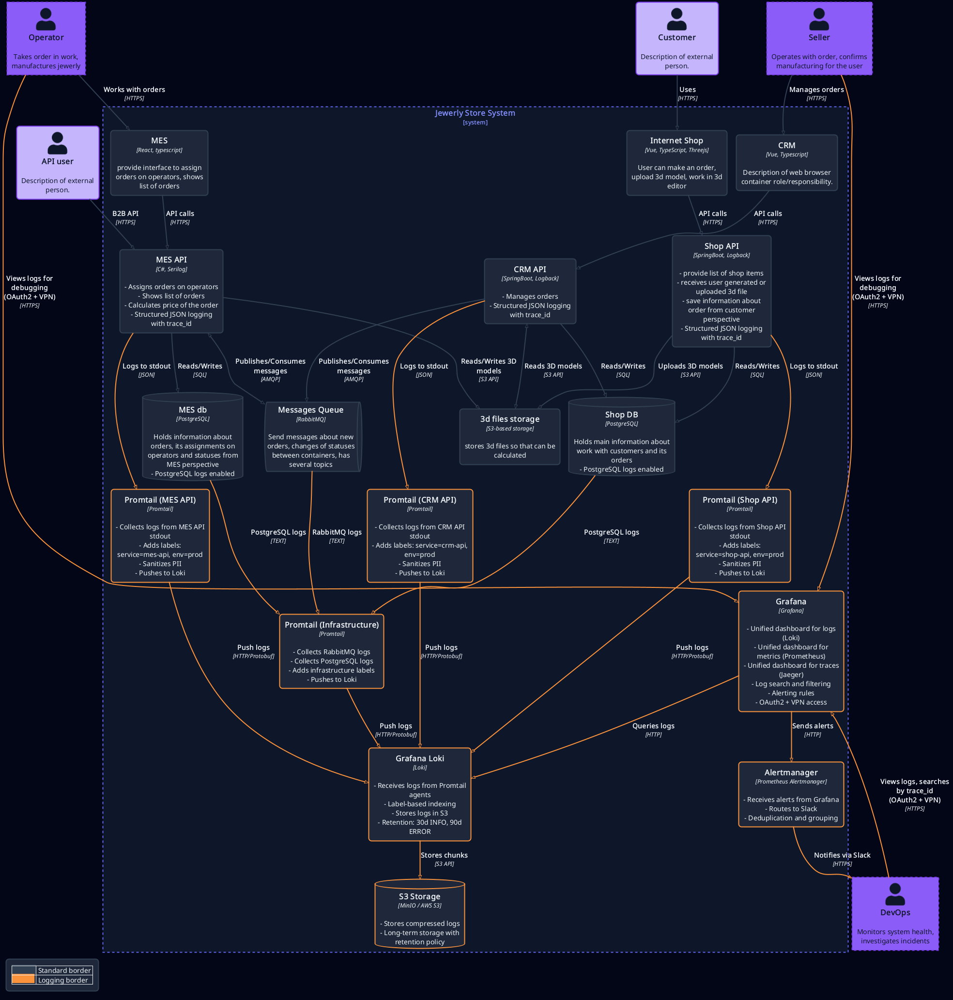

# Architecture Pro · Alexandrite Case

Пять архитектурных решений для восстановления цепочки заказа: приоритизация проблем, мониторинг, распределённый трейсинг, централизованное логирование и кеширование критичных сценариев.

## Навигация по заданиям

| # | Задание | Ключевые артефакты |
|---|---------|--------------------|
| 1 | План инициатив и критериев успеха | [Анализ проблем](Task1/%D0%9F%D0%BB%D0%B0%D0%BD%D0%B8%D1%80%D0%BE%D0%B2%D0%B0%D0%BD%D0%B8%D0%B5%3A%20%D0%B0%D0%BD%D0%B0%D0%BB%D0%B8%D0%B7%2C%20%D0%B8%D0%B4%D0%B5%D0%BD%D1%82%D0%B8%D1%84%D0%B8%D0%BA%D0%B0%D1%86%D0%B8%D1%8F%20%D0%BF%D1%80%D0%BE%D0%B1%D0%BB%D0%B5%D0%BC%20%D0%B8%20%D0%BF%D0%BE%D0%B8%D1%81%D0%BA%20%D1%80%D0%B5%D1%88%D0%B5%D0%BD%D0%B8%D0%B9.md) |
| 2 | Мониторинг и алертинг | [Обоснование мониторинга](Task2/%D0%92%D1%8B%D0%B1%D0%BE%D1%80%20%D0%B8%20%D0%BD%D0%B0%D1%81%D1%82%D1%80%D0%BE%D0%B9%D0%BA%D0%B0%20%D0%BC%D0%BE%D0%BD%D0%B8%D1%82%D0%BE%D1%80%D0%B8%D0%BD%D0%B3%D0%B0%20%D0%B2%20%D1%81%D0%B8%D1%81%D1%82%D0%B5%D0%BC%D0%B5.md) |
| 3 | Трейсинг end-to-end | [Архитектурное решение](Task3/%D0%90%D1%80%D1%85%D0%B8%D1%82%D0%B5%D0%BA%D1%82%D1%83%D1%80%D0%BD%D0%BE%D0%B5%20%D1%80%D0%B5%D1%88%D0%B5%D0%BD%D0%B8%D0%B5%20%D0%BF%D0%BE%20%D1%82%D1%80%D0%B5%D0%B9%D1%81%D0%B8%D0%BD%D0%B3%D1%83.md) • [Demo стенд](Task3/README.md) |
| 4 | Централизованное логирование | [Архитектурное решение](Task4/%D0%90%D1%80%D1%85%D0%B8%D1%82%D0%B5%D0%BA%D1%82%D1%83%D1%80%D0%BD%D0%BE%D0%B5%20%D1%80%D0%B5%D1%88%D0%B5%D0%BD%D0%B8%D0%B5%20%D0%BF%D0%BE%20%D0%BB%D0%BE%D0%B3%D0%B8%D1%80%D0%BE%D0%B2%D0%B0%D0%BD%D0%B8%D1%8E.md) • [C4-диаграмма](Task4/diag/logging-architecture-diagram.png) |
| 5 | Кеширование MES и Shop | [Архитектурное решение](Task5/%D0%90%D1%80%D1%85%D0%B8%D1%82%D0%B5%D0%BA%D1%82%D1%83%D1%80%D0%BD%D0%BE%D0%B5%20%D1%80%D0%B5%D1%88%D0%B5%D0%BD%D0%B8%D0%B5%20%D0%BF%D0%BE%20%D0%BA%D0%B5%D1%88%D0%B8%D1%80%D0%BE%D0%B2%D0%B0%D0%BD%D0%B8%D1%8E.md) • [Диаграмма чтения](Task5/diag/caching-read-orders-sequence.png) • [Диаграмма обновления](Task5/diag/caching-update-order-status-sequence.png) |

## Диаграммы

### Task3 — трейсинг

### Task4 — логирование

### Task5 — кеширование

