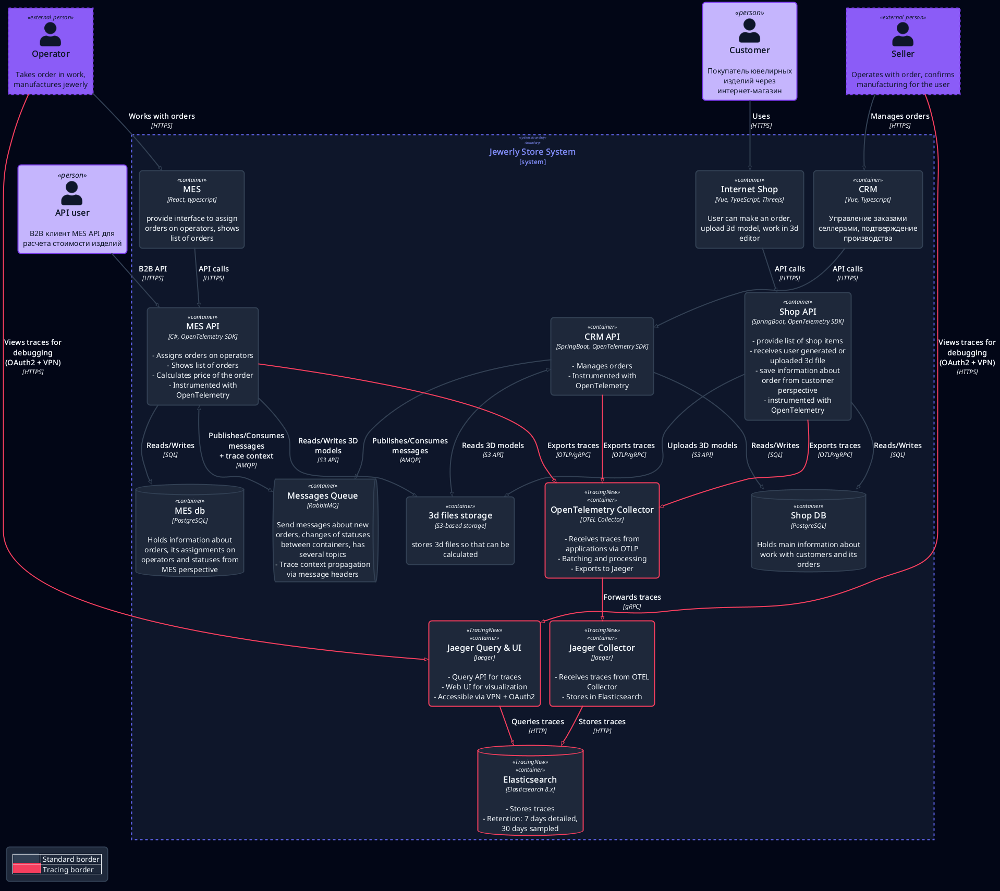
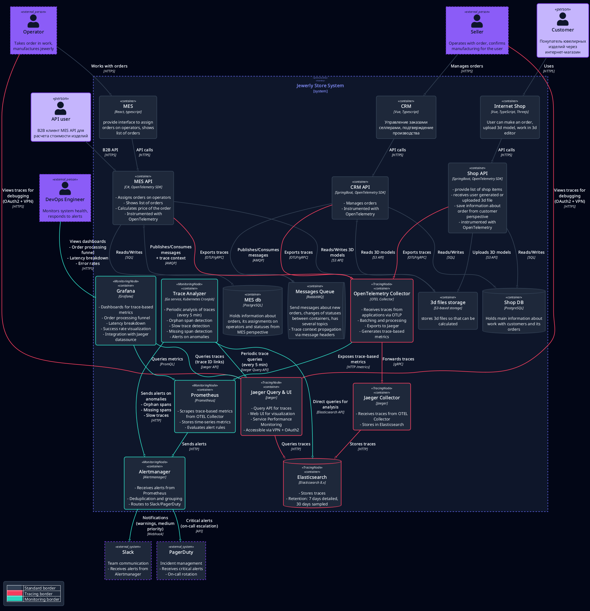

# Архитектурное решение по трейсингу

## Точки риска заказа

- Shop API > RabbitMQ: если брокер не подтверждает publish, статус заказа остаётся SUBMITTED.
- RabbitMQ > MES consumer: если consumer остановлен или выброшено исключение, брокер переносит сообщение в DLQ shop_to_mes.dlq. Заказ остаётся в SUBMITTED.
- MES расчёт цены: сегмент calculate_price достигает 30 минут или завершается нехваткой памяти, статус не меняется на PRICE_CALCULATED.
- MES > CRM через RabbitMQ: при отсутствии CRM consumer очередь mes_to_crm растёт, CRM не фиксирует MANUFACTURING_APPROVED.
- CRM approval > MES: publish в crm_to_mes без ack или остановленный consumer MES не создают MANUFACTURING_STARTED.

## Данные для трейсов

- Бизнесовые атрибуты: order.id, order.status, order.type, user.id, model.size_bytes, model.polygon_count.
- Технические: service.name, service.version, http.method, http.route, http.status_code, messaging.destination, messaging.operation, messaging.message_id, db.system, db.statement с sanitization.
- Ошибки: error.type, error.message, error.stack усеченный. Прокидываем W3C traceparent в HTTP и RabbitMQ headers.

## Мотивация

Технические метрики:
- MTTD менее 5 минут: Alertmanager инциденты, скользящее окно 30 дней
- MTTR менее 30 минут: медиана по постмортемам за 30 дней
- p95 calculate_price менее 30 минут: Prometheus histogram, окно 7 дней
- error rate RabbitMQ менее 1 процент: отношение trace_errors_total к trace_requests_total за 1 час
- end-to-end success более 99 процентов: доля трейсов без ошибок за 7 дней

Бизнес-метрики:
- Доля заказов без статуса PRICE_CALCULATED через 30 минут менее 1 процент, окно 7 дней
- 95 процентов заказов переходят в SHIPPED за 3 недели или менее
- Количество тикетов поддержки "заказ не найден" менее 5 в неделю

## Предлагаемое решение

### Выбор платформы трейсинга

Контекст: заказы из Shop не достигают MES и CRM, статус остаётся SUBMITTED. Команда не видит, какая интеграция нарушена. Необходимо обеспечить сквозную трассировку.

Решение:
- OpenTelemetry SDK в Shop API, CRM API и MES API
- RabbitMQ передаёт traceparent и tracestate через headers
- OpenTelemetry Collector принимает OTLP-трафик, батчит сегменты, экспортирует в Jaeger Collector и spanmetrics-коннектор
- Jaeger с хранилищем Elasticsearch для анализа трейсов
- Метрики от spanmetrics в Prometheus для алертинга

Последствия:
- MTTR и MTTD снижаются через непрерывный трейс с order.id и order.status
- Collector и Jaeger критичны - требуется минимум 2 экземпляра Collector, кластер Elasticsearch с репликой
- Необходимо удалять PII в Collector, ограничивать доступ к Jaeger через VPN и OAuth2 proxy

### Архитектура

Shop API и CRM API на Spring Boot используют opentelemetry-spring-boot-starter. MES API на C# задействует OpenTelemetry SDK. Publish и consume RabbitMQ сопровождаются сегментами трейса с передачей traceparent.

OpenTelemetry Collector принимает OTLP-трафик, агрегирует и обогащает сегменты, экспортирует их в Jaeger Collector и spanmetrics-коннектор.

Jaeger состоит из Collector и Query с UI. Elasticsearch хранит трейсы.

Диаграмма: [tracing-architecture-diagram.puml](./diag/tracing-architecture-diagram.puml)

## Автоматический мониторинг и алертинг

Collector публикует метрики на основе трейсов trace_duration_seconds и trace_errors_total в Prometheus.

Правила алертов:
- OrderStuckInSubmitted: histogram_quantile 0.95 rate trace_duration_seconds_bucket operation calculate_price более 1800 секунд в течение 10 минут
- RabbitMQErrorRate: rate trace_errors_total span_kind producer деленное на rate trace_requests_total span_kind producer более 0.01 в течение 15 минут
- PriceLatencyP95: histogram_quantile 0.95 rate trace_duration_seconds_bucket service mes-api более 1800 секунд в течение 10 минут

Alertmanager рассылает warning в Slack, critical в PagerDuty.

Grafana использует Prometheus и Jaeger datasource для дашбордов: воронка статусов, latency breakdown, список медленных трейсов.

Диаграмма: [tracing-with-monitoring-diagram.puml](./diag/tracing-with-monitoring-diagram.puml)

## Компромиссы

- Не добавляем трассировку к синхронным методам, которые не обращаются к внешним системам и обрабатываются с медианой менее 5 мс: сегмент не добавляет диагностической информации и увеличивает накладные расходы.
- Для методов с высоким числом запросов применяем выборку на входе: записываем 100 процентов трейсов с ошибками и случайные 10 процентов успешных.
- Для проприетарных внешних интерфейсов фиксируем только HTTP-вызов и длительность. Внутренние операции недоступны, поэтому граница трейса заканчивается на интеграции.

## Безопасность

- Доступ к Jaeger UI только через VPN и OAuth2-proxy с ролью Support или DevOps.
- TLS для OTLP и UI, аудит доступа через Nginx логи.
- Sanitization PII в SDK и Collector: user.email и auth headers.
- Retention: 7 дней полностью, 30 дней с выборкой. Индексы Elasticsearch шифруются.

## MVP и артефакты

- Go-сервисы service-a и service-b с REST и OpenTelemetry: ./service-a, ./service-b
- Kubernetes-манифесты Jaeger и сервисов: ./k8s
- Makefile с build, up, test, port-forward: [./Makefile](./Makefile)
- Smoke-тест трейсинга: ./scripts/smoke_test.py
- Скриншот трейса в Jaeger UI:

