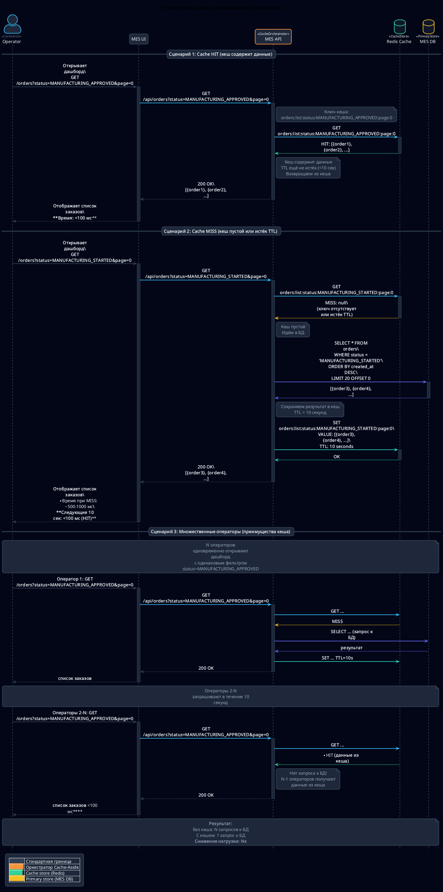
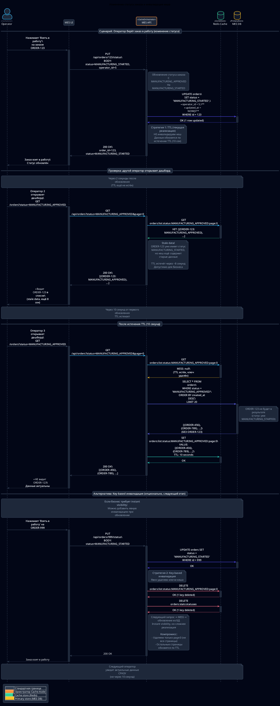

# Архитектурное решение по кешированию

## Мотивация

### Проблемы

**Проблема 1: Медленная загрузка дашборда MES**

Операторы жалуются на медленную загрузку страницы со списком заказов. Фильтры и пагинация не решили проблему. Операторы получают вознаграждение за первый взятый заказ.

Причина: каждый оператор открывает дашборд - запрос к mes_db. N операторов одновременно - N одинаковых запросов. Рост +100 заказов в месяц увеличивает время выполнения запроса.

**Проблема 2: Медленный расчет цены для повторяющихся моделей**

Расчет стоимости занимает 2-30 минут. B2B клиенты отправляют партии похожих моделей, каждая рассчитывается заново.

Причина: идентичная 3D-модель пересчитывается 2-30 минут вместо использования результата предыдущего расчета.

**Проблема 3: Избыточная нагрузка на shop_db**

Shop API и CRM API используют одну БД. Одновременные операции чтения и записи создают блокировки при обновлении статусов.

Причина: без кеша каждый запрос обращается к БД.

### Элементы системы для кеширования

| Приоритет | Элемент | Обоснование | TTL |
|-----------|---------|-------------|-----|
| Критично | Дашборд заказов MES API | Read-heavy workload, операторы теряют вознаграждение из-за медленной загрузки | 10 секунд |
| Высокий | Результаты расчета цены MES API | Расчет 2-30 минут vs менее 100 мс из кеша, одинаковая модель - одинаковая цена | 7 дней |
| Средний | Каталог товаров Shop API | Read-heavy workload, редко обновляется | 5 минут |
| Низкий | Данные пользователя | Read/Write ratio ниже чем у дашборда, меньшая нагрузка на БД | Не кешируется на первом этапе |

Ключи кеша:
- Дашборд MES: orders:list:status:{status}:page:{page}, orders:stats:statuses
- Расчет цены: price:calc:{sha256_hash}
- Каталог Shop: shop:products:list:page:{page}, shop:product:{id}

### Ожидаемый эффект

| Метрика | Целевое значение |
|---------|------------------|
| Время загрузки дашборда MES | менее 500 мс |
| Latency p95 для MES API списка заказов | менее 300 мс |
| Нагрузка на mes_db для дашборда | снижение |
| Нагрузка на shop_db для каталога | снижение |

## Предлагаемое решение

### Выбор типа кеширования: клиентское vs серверное

Выбор: серверное кеширование.

| Критерий | Клиентское | Серверное | Выбор |
|----------|------------|-----------|-------|
| Согласованность данных | Низкая - каждый клиент имеет свою копию | Высокая - единый источник данных | Серверное |
| Проблема дашборда MES | Не решает - клиенты запрашивают сервер, нагрузка на БД не снижается | Решает - запрос к БД 1 раз на N клиентов | Серверное |
| Cache hit rate | Низкий - разные пользователи, разные кеши | Высокий - все пользователи используют общий кеш | Серверное |
| Stale data | Высокий риск - старые данные на клиенте | Управляемый - TTL и инвалидация на сервере | Серверное |
| Применимость для расчета цены | Не применимо - клиент не может кешировать серверные вычисления | Применимо - результат доступен всем клиентам | Серверное |

### Выбор паттерна кеширования

Паттерн: Cache-Aside для всех компонентов.

Принцип работы Cache-Aside:
1. Приложение получает запрос
2. Проверяет кеш
3. Если HIT - возвращает из кеша
4. Если MISS - запрашивает БД, сохраняет в кеш с TTL, возвращает клиенту

Сравнение паттернов:

| Паттерн | Применимость | Сложность | Применение |
|---------|--------------|-----------|------------|
| Cache-Aside | Read-heavy workloads, допустима eventual consistency | Низкая | Дашборд MES, расчет цены, каталог Shop API |
| Write-Through | Требуется strong consistency, данные часто изменяются и читаются | Средняя | Не применимо - дашборд имеет сложную структуру кеша |
| Write-Behind | Очень высокая write throughput, допустима потеря данных | Высокая | Не применимо - заказы критичны, потеря недопустима |
| Refresh-Ahead | Предсказуемые паттерны доступа, критична latency | Высокая | Не применимо - паттерны доступа непредсказуемы |
| Read-Through | Упрощение кода приложения | Средняя | Не применимо - Cache-Aside проще |

Обоснование Cache-Aside для дашборда MES:

Read-heavy workload. Допустимость stale data: если оператор видит заказ с задержкой 10 секунд - приемлемо, важна скорость загрузки.

Write-Through: при каждом изменении статуса заказа нужно обновлять все ключи кеша - разные фильтры, страницы. Один заказ может быть во множестве ключей кеша. Сложность O(N) обновлений при каждой записи. Cache-Aside: O(1) - просто ждем TTL.

Refresh-Ahead: нужен отдельный worker, сложность определения каких ключей обновлять.

Обоснование Cache-Aside для расчета цены:

Расчет цены - read-only для кеша, результат никогда не изменяется. Write-Through и Refresh-Ahead не применимы.

### Диаграммы последовательности действий

#### Диаграмма 1: Чтение списка заказов

См. файл: diag/caching-read-orders-sequence.puml

Ключевые моменты:
- Cache HIT: Operator запрашивает список - MES API проверяет Redis - данные найдены - возврат менее 100 мс
- Cache MISS: Operator запрашивает - Redis пустой - MES API идет в БД - сохраняет в Redis с TTL=10 сек - возврат
- Множественные операторы: N операторов одновременно - первый MISS (запрос к БД) - остальные HIT (из кеша) - снижение нагрузки в N раз

Временные метрики:
- Cache HIT: менее 100 мс
- Cache MISS: 500-1000 мс
- Следующие 10 секунд: менее 100 мс для всех операторов

#### Диаграмма 2: Изменение статуса заказа

См. файл: diag/caching-update-order-status-sequence.puml

Ключевые моменты:
- Обновление статуса: оператор берет заказ в работу - MES API обновляет БД - не трогает кеш
- Stale data период: в течение 10 секунд другие операторы видят старые данные из кеша
- Истечение TTL: через 10 секунд TTL истекает - следующий запрос MISS - обновление из БД - актуальные данные

Допустимость stale data: операторы видят заказ с задержкой до 10 секунд - приемлемо. Важнее скорость загрузки дашборда. Race condition при взятии заказа решается optimistic locking на уровне БД.

### Стратегия инвалидации кеша

Выбор: комбинированная стратегия.
1. TTL - основная для дашборда и каталога
2. Инвалидация по ключу - дополнительная для критичных изменений
3. LRU eviction - для управления памятью Redis

#### Стратегия 1: TTL - основная

Принцип: при сохранении в кеш устанавливается время жизни. По истечении TTL Redis автоматически удаляет ключ. Следующий запрос - MISS - обновление из БД.

Применение:

| Компонент | TTL | Обоснование |
|-----------|-----|-------------|
| Дашборд MES список заказов | 10 секунд | Баланс между свежестью и снижением нагрузки на БД |
| Дашборд MES статистика | 10 секунд | Синхронно со списком |
| Каталог Shop API список | 5 минут | Редко меняется |
| Товар Shop API | 5 минут | Синхронно со списком |
| Расчет цены | 7 дней | Результат неизменен, популярные модели остаются, редкие удаляются LRU |

Сравнение стратегий инвалидации:

| Стратегия | Плюсы | Минусы | Применение |
|-----------|-------|--------|------------|
| TTL | Простота, надежность, нет багов | Stale data до истечения TTL | Основная: дашборд 10 сек, каталог 5 мин, расчет цены 7 дней |
| Key-based | Instant consistency, нет stale data | Сложность, риск багов, performance overhead | Дополнительная: если бизнес требует instant visibility |
| Программная | Контроль, debug | Человеческий фактор | Для экстренных случаев: endpoint /admin/cache/flush |
| Pattern-based | Массовая очистка группы ключей | Performance overhead, риск over-invalidation | Для экстренных случаев |

Обоснование TTL:

Инвалидация при изменении статуса заказа требует обновления множества ключей с разными статусами и страницами. Сложность определения всех затронутых ключей. TTL: кеш обновится автоматически через 10 секунд.

Компромисс: 10 секунд stale data vs простота и надежность.

#### Стратегия 2: Key-based инвалидация - дополнительная

Принцип: при критичном изменении явно удаляем ключ из кеша.

Применение: опционально, если бизнес требует instant visibility для новых заказов. Удаляем только page:0, остальные страницы обновятся по TTL.

На первом этапе: не используем, достаточно TTL.

#### Стратегия 3: LRU Eviction - для управления памятью

Принцип: Redis имеет лимит памяти. При достижении лимита Redis удаляет наименее используемые ключи.

Конфигурация: maxmemory 4gb, maxmemory-policy allkeys-lru

Применимость:
- Дашборд MES: LRU удалит старые страницы
- Расчет цены: LRU удалит редкие модели, популярные останутся
- Каталог Shop API: LRU удалит старые продукты

### Техническая реализация

Компоненты:
- MES API, Shop API, CRM API - клиенты Redis
- Redis Cache - Yandex Cloud Managed Redis 4GB RAM, 1 master + 1 replica
- MES DB, Shop DB - PostgreSQL

Технологии:
- Redis 6.2
- StackExchange.Redis для C#
- Spring Data Redis для Java

Мониторинг:

| Метрика | Целевое значение | Alert |
|---------|------------------|-------|
| cache_hit_rate | более 80% | менее 60% |
| redis_used_memory | менее 3.5 GB из 4GB | более 3.8 GB |
| redis_evicted_keys | менее 1000 в час | более 5000 в час |
| redis_latency_avg | менее 5 мс | более 20 мс |
| db_query_count | снижение | рост после внедрения |
| api_latency_p95 MES дашборд | менее 500 мс | более 1 сек |

Риски и митигация:

| Риск | Вероятность | Влияние | Митигация |
|------|-------------|---------|-----------|
| Stale data приводит к race condition | Medium | High | Optimistic locking на уровне БД |
| Redis недоступен | Low | Medium | Try-catch: Redis fail - query DB напрямую |
| Память Redis заполнена | Medium | Medium | Мониторинг used_memory, alert при более 95% |
| TTL слишком большой | Low | Medium | Начать с TTL=10 сек, измерить, скорректировать |
| TTL слишком маленький | Medium | Low | Мониторинг hit rate, увеличить TTL если менее 60% |

План внедрения:

| Этап | Срок | Задачи |
|------|------|--------|
| 1. Инфраструктура | Неделя 1 | Создать Redis инстанс Yandex Cloud, настроить network access, настроить мониторинг |
| 2. Разработка | Неделя 2-3 | MES API кеширование дашборда и расчета цены, Shop API кеширование каталога, code review, unit tests |
| 3. Тестирование | Неделя 3 | Тестирование на dev, нагрузочное тестирование, тестирование failover и fallback |
| 4. Rollout | Неделя 4 | Деплой в release, canary deployment в production 10% трафика, анализ метрик, full rollout 100% |
| 5. Мониторинг | Continuous | Измерение бизнес-метрик, оптимизация TTL, рассмотрение следующего этапа |

